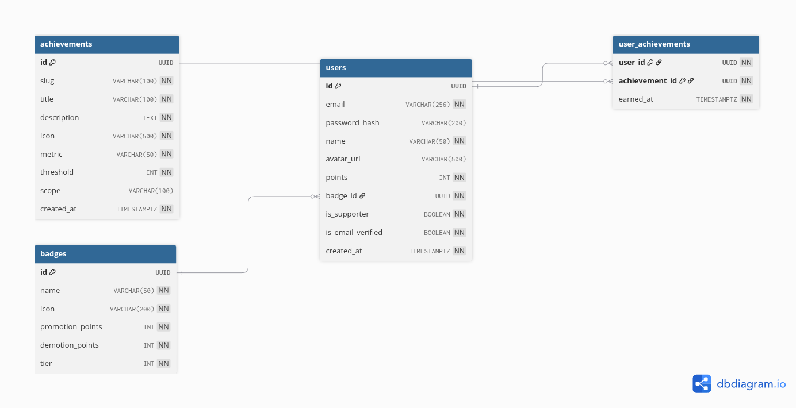

# 07. Achievements ERD

## Interactive Mermaid Source

erDiagram
ACHIEVEMENTS ||--o{ USER_ACHIEVEMENTS : "granted via"
USERS ||--o{ USER_ACHIEVEMENTS : "earns"

    ACHIEVEMENTS {
        uuid id PK
        string slug UK
        string title
        text description
        string icon
        string metric
        int threshold
        string scope
        timestamptz created_at
    }

    USER_ACHIEVEMENTS {
        uuid user_id PK,FK
        uuid achievement_id PK,FK
        timestamptz earned_at
    }