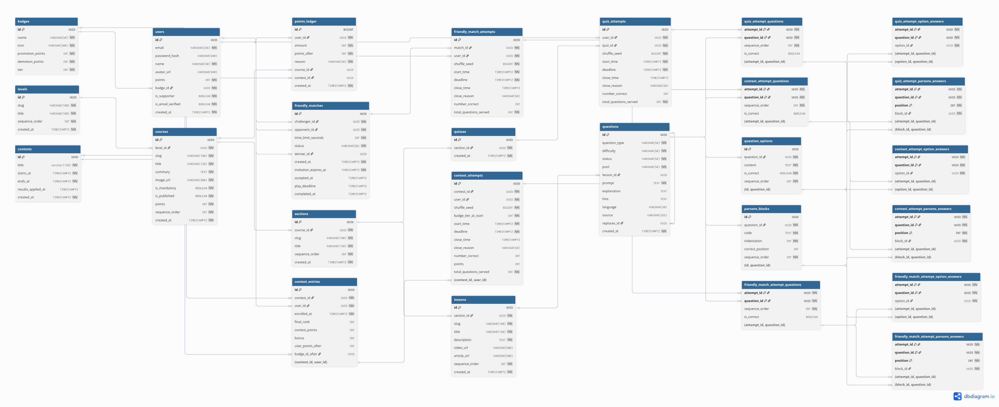

# 06. Attempts & Points Ledger ERD

## Interactive Mermaid Source

erDiagram
USERS ||--o{ QUIZ_ATTEMPTS : "takes"
QUIZZES ||--o{ QUIZ_ATTEMPTS : "attempted in"
QUIZ_ATTEMPTS ||--o{ QUIZ_ATTEMPT_QUESTIONS : "snapshots"
QUIZ_ATTEMPT_QUESTIONS ||--o| QUIZ_ATTEMPT_OPTION_ANSWERS : "answers MC"
QUIZ_ATTEMPT_QUESTIONS ||--o{ QUIZ_ATTEMPT_PARSONS_ANSWERS : "answers Parsons"

    CONTEST_ENTRIES ||--o| CONTEST_ATTEMPTS : "executes"
    CONTEST_ATTEMPTS ||--o{ CONTEST_ATTEMPT_QUESTIONS : "snapshots"
    CONTEST_ATTEMPT_QUESTIONS ||--o| CONTEST_ATTEMPT_OPTION_ANSWERS : "answers MC"
    CONTEST_ATTEMPT_QUESTIONS ||--o{ CONTEST_ATTEMPT_PARSONS_ANSWERS : "answers Parsons"

    FRIENDLY_MATCHES ||--o{ FRIENDLY_MATCH_ATTEMPTS : "has player attempts"
    USERS ||--o{ FRIENDLY_MATCH_ATTEMPTS : "plays"
    FRIENDLY_MATCH_ATTEMPTS ||--o{ FRIENDLY_MATCH_ATTEMPT_QUESTIONS : "snapshots"
    FRIENDLY_MATCH_ATTEMPT_QUESTIONS ||--o| FRIENDLY_MATCH_ATTEMPT_OPTION_ANSWERS : "answers MC"
    FRIENDLY_MATCH_ATTEMPT_QUESTIONS ||--o{ FRIENDLY_MATCH_ATTEMPT_PARSONS_ANSWERS : "answers Parsons"

    USERS ||--o{ POINTS_LEDGER : "earns / loses"
    COURSES ||--o| POINTS_LEDGER : "awards points"
    CONTESTS ||--o| POINTS_LEDGER : "awards points"

    QUIZ_ATTEMPTS {
        uuid id PK
        uuid user_id FK
        uuid quiz_id FK
        bigint shuffle_seed
        timestamptz start_time
        timestamptz deadline
        timestamptz close_time
        string close_reason
        int number_correct
        int total_questions_served
    }

    QUIZ_ATTEMPT_QUESTIONS {
        uuid attempt_id PK,FK
        uuid question_id PK,FK
        int sequence_order
        boolean is_correct
    }

    QUIZ_ATTEMPT_OPTION_ANSWERS {
        uuid attempt_id PK,FK
        uuid question_id PK,FK
        uuid option_id FK
    }

    QUIZ_ATTEMPT_PARSONS_ANSWERS {
        uuid attempt_id PK,FK
        uuid question_id PK,FK
        int position PK
        uuid block_id FK
    }

    CONTEST_ATTEMPTS {
        uuid id PK
        uuid contest_id FK
        uuid user_id FK
        bigint shuffle_seed
        int badge_tier_at_start
        timestamptz start_time
        timestamptz deadline
        timestamptz close_time
        string close_reason
        int number_correct
        int points
        int total_questions_served
    }

    CONTEST_ATTEMPT_QUESTIONS {
        uuid attempt_id PK,FK
        uuid question_id PK,FK
        int sequence_order
        boolean is_correct
    }

    CONTEST_ATTEMPT_OPTION_ANSWERS {
        uuid attempt_id PK,FK
        uuid question_id PK,FK
        uuid option_id FK
    }

    CONTEST_ATTEMPT_PARSONS_ANSWERS {
        uuid attempt_id PK,FK
        uuid question_id PK,FK
        int position PK
        uuid block_id FK
    }

    FRIENDLY_MATCH_ATTEMPTS {
        uuid id PK
        uuid match_id FK
        uuid user_id FK
        bigint shuffle_seed
        timestamptz start_time
        timestamptz deadline
        timestamptz close_time
        string close_reason
        int number_correct
        int total_questions_served
    }

    FRIENDLY_MATCH_ATTEMPT_QUESTIONS {
        uuid attempt_id PK,FK
        uuid question_id PK,FK
        int sequence_order
        boolean is_correct
    }

    FRIENDLY_MATCH_ATTEMPT_OPTION_ANSWERS {
        uuid attempt_id PK,FK
        uuid question_id PK,FK
        uuid option_id FK
    }

    FRIENDLY_MATCH_ATTEMPT_PARSONS_ANSWERS {
        uuid attempt_id PK,FK
        uuid question_id PK,FK
        int position PK
        uuid block_id FK
    }

    POINTS_LEDGER {
        bigint id PK
        uuid user_id FK
        int amount
        int points_after
        string reason
        uuid course_id FK
        uuid contest_id FK
        timestamptz created_at
    }