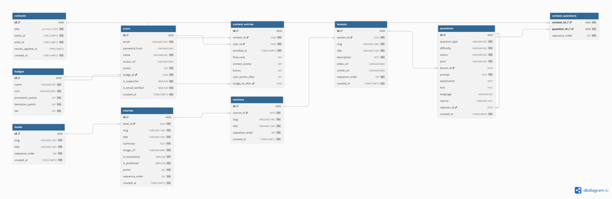

# 04. Contests ERD

## Interactive Mermaid Source

erDiagram
CONTESTS ||--o{ CONTEST_ENTRIES : "has entry"
USERS ||--o{ CONTEST_ENTRIES : "participates in"
BADGES ||--o| CONTEST_ENTRIES : "awarded after"
CONTESTS ||--o{ CONTEST_QUESTIONS : "contains"
QUESTIONS ||--o{ CONTEST_QUESTIONS : "selected for"

    CONTESTS {
        uuid id PK
        string title
        timestamptz starts_at
        timestamptz ends_at
        timestamptz results_applied_at
    }

    CONTEST_ENTRIES {
        uuid id PK
        uuid contest_id FK
        uuid user_id FK
        timestamptz enrolled_at
        int final_rank
        int contest_points
        int bonus
        int user_points_after
        uuid badge_id_after FK
    }

    CONTEST_QUESTIONS {
        uuid contest_id PK,FK
        uuid question_id PK,FK
        int sequence_order
    }