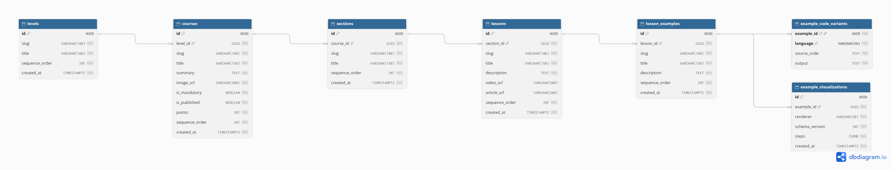
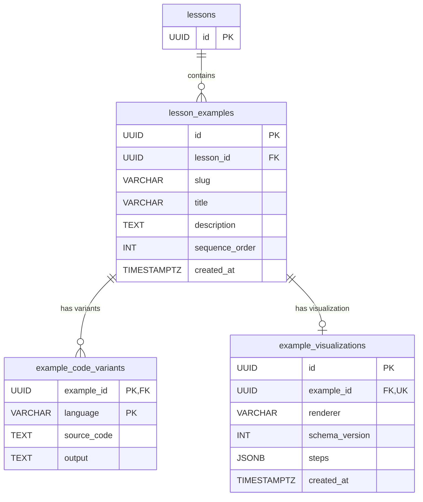

# 09. Interactive examples ERD

## Interactive Mermaid Source

```mermaid
erDiagram
lessons ||--o{ lesson_examples : "contains"
lesson_examples ||--o{ example_code_variants : "has variants"
lesson_examples ||--o| example_visualizations : "has visualization"

    lessons {
        UUID id PK
    }

    lesson_examples {
        UUID id PK
        UUID lesson_id FK
        VARCHAR slug
        VARCHAR title
        TEXT description
        INT sequence_order
        TIMESTAMPTZ created_at
    }

    example_code_variants {
        UUID example_id PK, FK
        VARCHAR language PK
        TEXT source_code
        TEXT output
    }

    example_visualizations {
        UUID id PK
        UUID example_id FK, UK
        VARCHAR renderer
        INT schema_version
        JSONB steps
        TIMESTAMPTZ created_at
    }
```