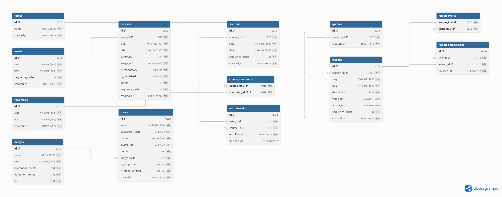

# 02. Learning Content & Learner Progress ERD

## Interactive Mermaid Source

erDiagram
LEVELS ||--o{ COURSES : "contains"
COURSES ||--o{ SECTIONS : "contains"
SECTIONS ||--o| QUIZZES : "has"
SECTIONS ||--o{ LESSONS : "contains"
LESSONS ||--o{ LESSON_TOPICS : "teaches"
TOPICS ||--o{ LESSON_TOPICS : "categorizes"
COURSES ||--o{ COURSE_ROADMAPS : "belongs to"
ROADMAPS ||--o{ COURSE_ROADMAPS : "includes"
USERS ||--o{ ENROLLMENTS : "enrolls in"
COURSES ||--o{ ENROLLMENTS : "tracked in"
USERS ||--o{ LESSON_COMPLETIONS : "completes"
LESSONS ||--o{ LESSON_COMPLETIONS : "completed in"

    LEVELS {
        uuid id PK
        string slug UK
        string title
        int sequence_order UK
    }

    COURSES {
        uuid id PK
        uuid level_id FK
        string slug UK
        string title
        string summary
        string image_url
        boolean is_mandatory
        boolean is_published
        int points
        int sequence_order
    }

    SECTIONS {
        uuid id PK
        uuid course_id FK
        string slug
        string title
        int sequence_order
    }

    QUIZZES {
        uuid id PK
        uuid section_id FK,UK
        timestamptz created_at
    }

    LESSONS {
        uuid id PK
        uuid section_id FK
        string slug
        string title
        string description
        string video_url
        string article_url
        int sequence_order
    }

    TOPICS {
        uuid id PK
        string name UK
    }

    LESSON_TOPICS {
        uuid lesson_id PK,FK
        uuid topic_id PK,FK
    }

    ROADMAPS {
        uuid id PK
        string slug UK
        string title
    }

    COURSE_ROADMAPS {
        uuid course_id PK,FK
        uuid roadmap_id PK,FK
    }

    ENROLLMENTS {
        uuid id PK
        uuid user_id FK
        uuid course_id FK
        timestamptz enrolled_at
        timestamptz finished_at
    }

    LESSON_COMPLETIONS {
        uuid id PK
        uuid user_id FK
        uuid lesson_id FK
        timestamptz finished_at
    }