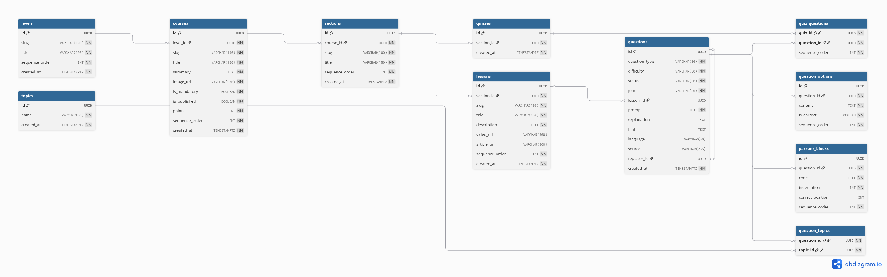

# 03. Questions Bank & Quiz Definitions ERD

## Interactive Mermaid Source

erDiagram
LESSONS ||--o{ QUESTIONS : "quiz questions pool"
QUESTIONS ||--o| QUESTIONS : "replaces / versions"
QUESTIONS ||--o{ QUESTION_TOPICS : "tagged with"
TOPICS ||--o{ QUESTION_TOPICS : "associates"
QUESTIONS ||--o{ QUESTION_OPTIONS : "has options"
QUESTIONS ||--o{ PARSONS_BLOCKS : "has blocks"
QUIZZES ||--o{ QUIZ_QUESTIONS : "includes"
QUESTIONS ||--o{ QUIZ_QUESTIONS : "assigned to"

    QUESTIONS {
        uuid id PK
        string question_type
        string difficulty
        string status
        string pool
        uuid lesson_id FK
        text prompt
        text explanation
        text hint
        string language
        string source
        uuid replaces_id FK
    }

    QUESTION_TOPICS {
        uuid question_id PK,FK
        uuid topic_id PK,FK
    }

    QUESTION_OPTIONS {
        uuid id PK
        uuid question_id FK
        text content
        boolean is_correct
        int sequence_order
    }

    PARSONS_BLOCKS {
        uuid id PK
        uuid question_id FK
        text code
        int indentation
        int correct_position
        int sequence_order
    }

    QUIZ_QUESTIONS {
        uuid quiz_id PK,FK
        uuid question_id PK,FK
        int sequence_order
    }