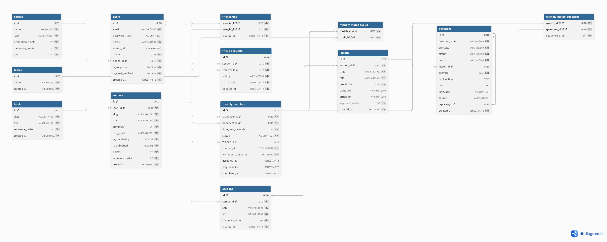

# 05. Social & Friendly Matches ERD

## Interactive Mermaid Source

erDiagram
USERS ||--o{ FRIENDSHIPS : "friend_1 / friend_2"
USERS ||--o{ FRIEND_REQUESTS : "sends / receives"
USERS ||--o{ FRIENDLY_MATCHES : "challenger / opponent / winner"
FRIENDLY_MATCHES ||--o{ FRIENDLY_MATCH_TOPICS : "filtered by"
TOPICS ||--o{ FRIENDLY_MATCH_TOPICS : "selected"
FRIENDLY_MATCHES ||--o{ FRIENDLY_MATCH_QUESTIONS : "serves"
QUESTIONS ||--o{ FRIENDLY_MATCH_QUESTIONS : "selected for"

    FRIENDSHIPS {
        uuid user_id_1 PK,FK
        uuid user_id_2 PK,FK
        timestamptz created_at
    }

    FRIEND_REQUESTS {
        uuid id PK
        uuid sender_id FK
        uuid receiver_id FK
        string status
        timestamptz created_at
        timestamptz updated_at
    }

    FRIENDLY_MATCHES {
        uuid id PK
        uuid challenger_id FK
        uuid opponent_id FK
        int time_limit_seconds
        string status
        uuid winner_id FK
        timestamptz created_at
        timestamptz invitation_expires_at
        timestamptz accepted_at
        timestamptz play_deadline
        timestamptz completed_at
    }

    FRIENDLY_MATCH_TOPICS {
        uuid match_id PK,FK
        uuid topic_id PK,FK
    }

    FRIENDLY_MATCH_QUESTIONS {
        uuid match_id PK,FK
        uuid question_id PK,FK
        int sequence_order
    }