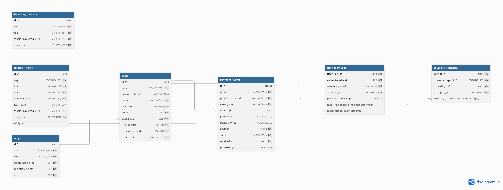
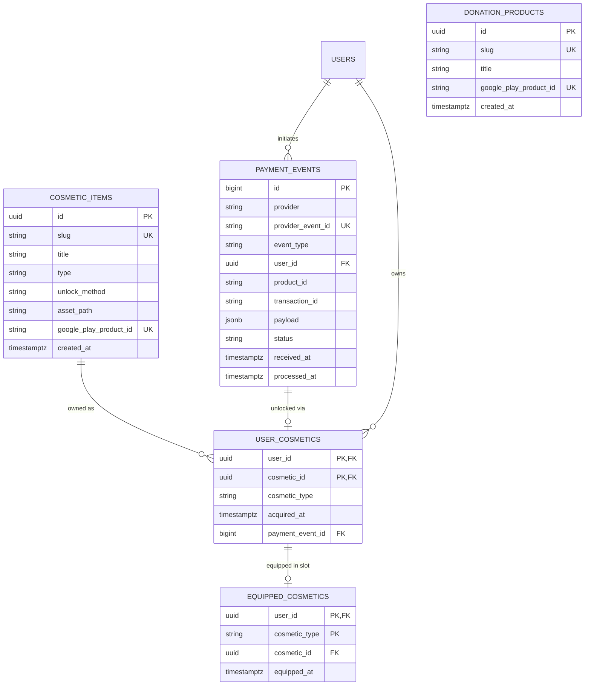

# 08. Store & Cosmetics ERD

## Interactive Mermaid Source

```mermaid
erDiagram
USERS ||--o{ PAYMENT_EVENTS : "initiates"
COSMETIC_ITEMS ||--o{ USER_COSMETICS : "owned as"
PAYMENT_EVENTS ||--o| USER_COSMETICS : "unlocked via"
USERS ||--o{ USER_COSMETICS : "owns"
USER_COSMETICS ||--o| EQUIPPED_COSMETICS : "equipped in slot"

    PAYMENT_EVENTS {
        bigint id PK
        string provider
        string provider_event_id UK
        string event_type
        uuid user_id FK
        string product_id
        string transaction_id
        jsonb payload
        string status
        timestamptz received_at
        timestamptz processed_at
    }

    COSMETIC_ITEMS {
        uuid id PK
        string slug UK
        string title
        string type
        string unlock_method
        string asset_path
        string google_play_product_id UK
        timestamptz created_at
    }

    DONATION_PRODUCTS {
        uuid id PK
        string slug UK
        string title
        string google_play_product_id UK
        timestamptz created_at
    }

    USER_COSMETICS {
        uuid user_id PK,FK
        uuid cosmetic_id PK,FK
        string cosmetic_type
        timestamptz acquired_at
        bigint payment_event_id FK
    }

    EQUIPPED_COSMETICS {
        uuid user_id PK,FK
        string cosmetic_type PK
        uuid cosmetic_id FK
        timestamptz equipped_at
    }
```