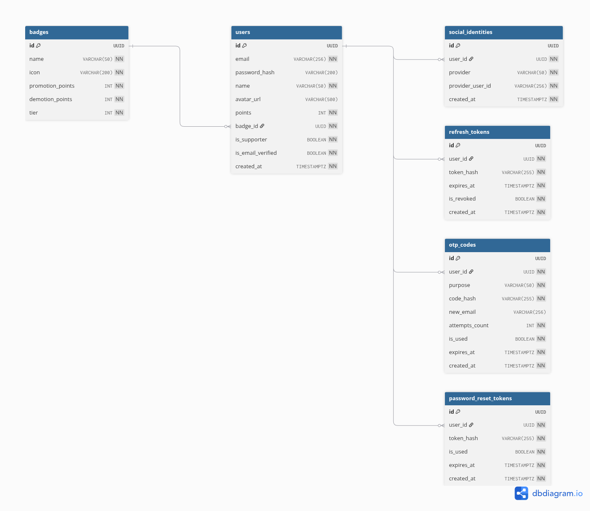
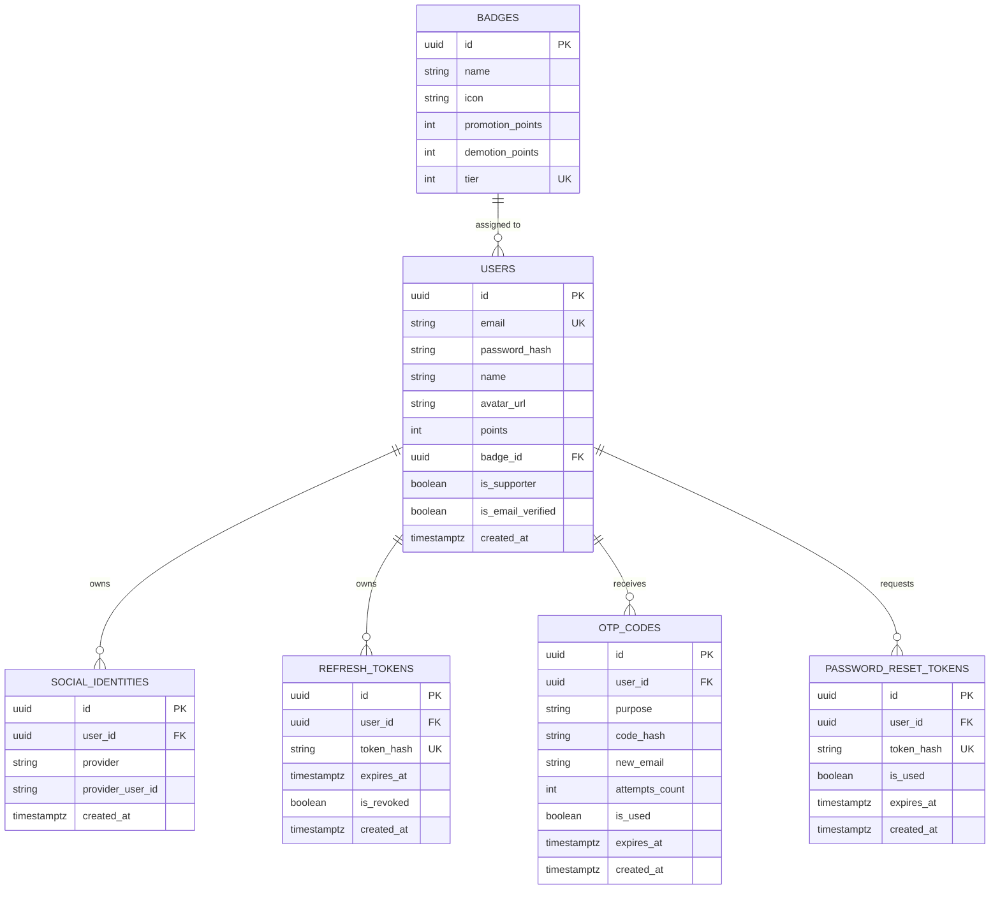

# 01. Authentication & Users ERD

## Interactive Mermaid Source

```mermaid
erDiagram
BADGES ||--o{ USERS : "assigned to"
USERS ||--o{ SOCIAL_IDENTITIES : "owns"
USERS ||--o{ REFRESH_TOKENS : "owns"
USERS ||--o{ OTP_CODES : "receives"
USERS ||--o{ PASSWORD_RESET_TOKENS : "requests"

    BADGES {
        uuid id PK
        string name
        string icon
        int promotion_points
        int demotion_points
        int tier UK
    }

    USERS {
        uuid id PK
        string email UK
        string password_hash
        string name
        string avatar_url
        int points
        uuid badge_id FK
        boolean is_supporter
        boolean is_email_verified
        timestamptz created_at
    }

    SOCIAL_IDENTITIES {
        uuid id PK
        uuid user_id FK
        string provider
        string provider_user_id
        timestamptz created_at
    }

    REFRESH_TOKENS {
        uuid id PK
        uuid user_id FK
        string token_hash UK
        timestamptz expires_at
        boolean is_revoked
        timestamptz created_at
    }

    OTP_CODES {
        uuid id PK
        uuid user_id FK
        string purpose
        string code_hash
        string new_email
        int attempts_count
        boolean is_used
        timestamptz expires_at
        timestamptz created_at
    }

    PASSWORD_RESET_TOKENS {
        uuid id PK
        uuid user_id FK
        string token_hash UK
        boolean is_used
        timestamptz expires_at
        timestamptz created_at
    }
```